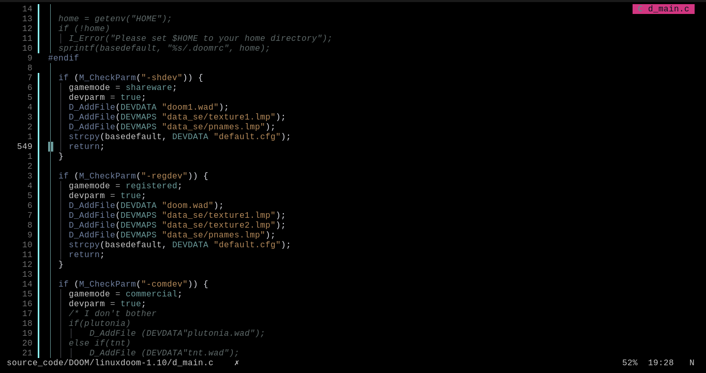

## `brellary.nvim` - The only low-contrast colorscheme.

Brellary is a colorscheme for Neovim that I (bavajitu) created. It's a low contrast colorscheme which is very very less fatiguing on eyes even on very long coding sessions.
I created this colorscheme for myself when I say people I inspire - [Rexim](https://github.com/tsoding) and [Jonathan Blow](https://www.youtube.com/@jblow888) were using their own colorschemes. It really motivated me to create my own colorscheme that I tailor to my own requirements which were basically:

- Minimal colorscheme
- Easy on the eyes, even after hours of coding
- No neon colors like that in Tokyonight and Nightfox
- I should be able to visually separate the various components/functions of my programs clearly.

**Note**: I created this colorscheme for my C/C++ development workflow and I've only tested this colorscheme in C, C++, Assembly, Lua, Bash and RC files.



---

## Installation:

The installation for this colorscheme is something that I wouldn't really call straight forward, since I didn't go for a one-file configuration. So, here are the steps:

- Clone the repository:

```bash
git clone https://github.com/bavajitu/brellary.nvim.git
```

- Move the contents of `/brellary` into `$HOME/.config/nvim/brellary/`.
- Move contents of `/lua` into `$HOME/.config/nvim/lua/` or make sure you match your existing configuration and copy the contents accordingly.
- Finally, create a `$HOME/.config/nvim/colors/brellary.lua` inorder to actually initiate and tell Neovim that Brellary is a colorscheme that we want to use.
- Load and enjoy your new colorscheme!
