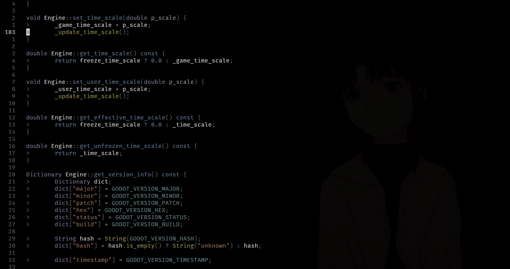
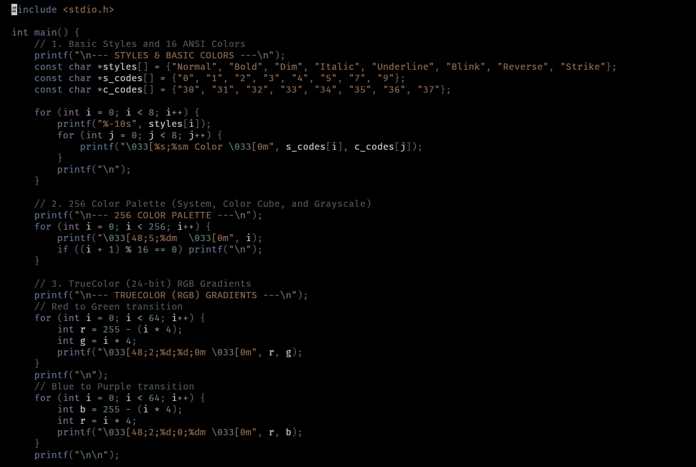

## `brellary.nvim` - The only low-contrast colorscheme.

Brellary is a colorscheme for Neovim that I (bavajitu) created. It's a low contrast colorscheme which is very very less fatiguing on eyes even on very long coding sessions.
I created this colorscheme for myself when I say people I inspire - [Rexim](https://github.com/tsoding) and [Jonathan Blow](https://www.youtube.com/@jblow888) were using their own colorschemes. It really motivated me to create my own colorscheme that I tailor to my own requirements which were basically:

**Major Notice**: This color scheme follows a completely transparent background philosophy, so the pop-ups and the windows will be transparent of will inherit your terminal emulator's background color. For the best use case, the recommended terminal background color is `#1e1e1e`.

- Minimal colorscheme
- Easy on the eyes, even after hours of coding
- No neon colors like that in Tokyonight and Nightfox
- I should be able to visually separate the various components/functions of my programs clearly.

**Note 1**: Even though this colorscheme's groups configuration has been modified for C, C++, LaTeX and Markdown. Proper syntax highlighting for Rust or other languages is not guaranteed and any advice for the colorscheme for any particular language is appreciated. Also, you are free to clone this repository, modify it to your needs and use it for your self.

**Note 2**: The undercurls/underlines haven't been defined in the colorscheme itself as it might over-write or cause issues with the existing config. Therefore, it's recommended to configure the undercurls or underlines manually in the `options.lua` file.

---

## Installation:

1. Lazy.nvim:

```lua
return {
    {
        "bavajitu/brellary.nvim",
        lazy = false,
        priority = 1000,
        config = function()
            vim.cmd.colorscheme("brellary")
        end,
    },
}
```

2. Vim Plug

```vim
Plug "bavajitu/brellary.nvim"
```

## Screenshots




Have a great day!
